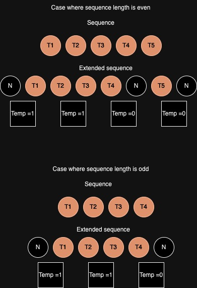
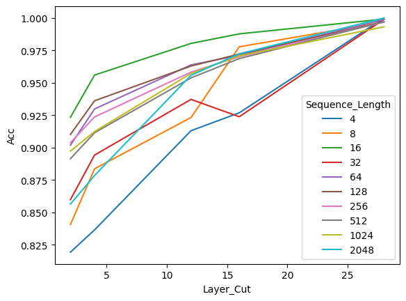
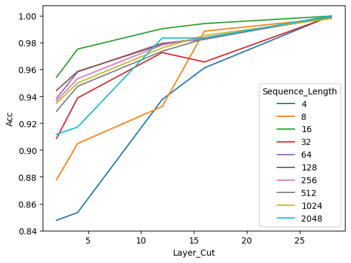

# Fast inference with token merging

This repo hosts codes and materials related to speeding LLMs' generative abilities while preserving quality using tokens' merging.

I propose a technique to modify the forward call of a LLM to reduce the sequence length of the input by merging elements using SLERP. The results shows a significative speed-up while preserving quality. 

## Background

Decoder-only Large Language Models are trained using a causal masking process enabling them to learn in a single forward pass to predict the next token based on the previous. When used for different use cases, we generate text by iteratively predict the token, append it to the en d of the sequence and re-run the process. Significant improvements have been made to speed up this (kv cache, quantization...). However, the core procedure remains unchanged and we generate each token one by one. 

## Questionning the need of full sequence length for last token generation

When giving looks at attention masks in different LLMs, we often see that to predict the n-th token, the attention is on average put on the bos token (the first token of the sequence) and the n-th-1 (the last token available). The "middle" context is less used (from what I saw, I can't prove it theoretically), many RAG experiments also support this point with the need of reranking the context properly to generate useful answers.

Keeping full sequence is also a challenge as it impacts strongly the computing power required by the model to process it. Transformers computing needs scale quadratically with the input sequence length, posing major challenges both from a training or generating aspect. 

My question is: to predict accurately the next token regardless of the sequence lentgh, shall we keep the full past tokens or could we merge them ? 

## Merging is the new fashion 

Such proposal has been made in different papers and filed. I personnally looked at this resources:
- Token Merging Stable Diffusion (paper) : https://arxiv.org/abs/2303.17604
- Token Merging Stable Diffusion (library) : https://huggingface.co/docs/diffusers/optimization/tome
- Token Merging NLP (paper) : https://llm-random.github.io/posts/mixture_of_tokens/

TLDR; those papers start with the same assumption and merge the token in the input by averaging or learned representations. 

More recently, the mergekit library showcased the deep power of a relatively unknown merging techniques which is SLERP for Spherical Linear Interpolation. This merging technique is different from the simple average as it interpolates between two vectors by preserving the spherical aspects of their dimensions. 

## Merging sequence using SLERP

The proposed merging procedure is as following:
- The input sequence is:
    - being kept unchanged if its length is inferior to 3
    - being extended by 2 (one null token at the beginning and at the end) if the length is odd
    - being extended by 3 (one null token ath the beginning, at the penultimate position and one at the end) if the length is even
- The new sequence is reformatted in a sequence of pairs of consecutive tokens with a temperature defined appropriately if one of the token is null
- The sequence of pairs is aggregated using a torch version of SLERP

The core idea is to reduce the length of the sequence by a factor of two (not exactly as you get two or three aditional tokens). 

Under is a scheme representing the process of extending the sequence:

Here is a scheme summarizing the global merging procedure:

The merging could occur at different level of the model architecture. This parameter is referred as "layer cutoff". 
Also, to ensure that a prompt is not completely merged, you can define a part of the sequence at the beginnig and/or at the end to be kept unchanged. It is more efficient for Instruct-based Models where the starting part of the prompt should be always reminded. 

One downside of this methodology is that it strongly relies on the underlying forward pass of the used model, requiring you to carefully rewrite the "merged" process depending on the chosen model. Another downside is the necessity of recomputing attention masks and possibly positional embeddings at each step.

The main advantage is its simplicity.

## Results and first comments

I conducted experiments on a Mistral 7B Instruct V0.2 model. My experiment is split in two steps.

### Next Token Generation
First I conducted tokens' generations on 5k texts randomly picked from the CNN daily mail datasets

I compare top 5 predictions of a base model kept unchanged and several variations (different layer cutoffs) of the merged model at inference. Using the huggingface pipeline helps me to easily run variations. I apply it on sequence of different lentghs (4, 8, 16, 32, 64, 128, 256, 512, 1024 and 2048).

Overall, merging tokens does not dramatically change the quality of the predictions and this is even more the case for shallower layers. This is also supported by a recent paper from Stanford proving that we could drop up to 40% of the layers (especially the last one) without seeing a decrease in quality.

#### Accuracy for the first predicted tokens

The accuracy of the first predicted tokens for the merged and base model grow linearly with the merged layer position. Suprisingly, the accuracy starts at 70% for a layer cut at the 4th attention module.

No pattern in terms of shorter/longer sequence seems to emerge.

#### Top 3 accuracy for the first predicted tokens

This plot shows the top 3 accuracy between the predicted tokens of the merged inference model and the base one.

#### Top 5 accuracy for the first predicted tokens

This plot shows the top 5 accuracy between the predicted tokens of the merged inference model and the base one.

#### (to be optimized) Estimated time gains

This plot shows how many time faster the prediction of a token is between a base and merged model at different sequence length. This aprt could definitely be rewritten as many optimizations could be found in the code and the forward call.

### AlpacaEval 2.0

To see how bad/good the model is when merged at inference (layer cutoff set at 20), I compared a merged version to a vanilla one on the AlpacaEval benchmark (805 prompts). The leaderboard and annotations are available in the folder "code/alpaca". 

Two comments can be made:
- Its does not excessively impact the quality of the output as the merged model loses 4% of winrate (not length controlled) and 7% of winrate (length controlled). Even though it is not entirely sound, it demonstrates that the model is still "alive" and not too far from the base one.
- Merging tokens increase the verbosity of the model as the average length of the output is increased by 600 tokens. This comes from the imapct of a shorter sequence fed to the layers, resulting in different positional encodings which tend to delay the occurrence of eos_token.

The model still outperforms gemma-7b-it	 text_davinci_001 or nous-hermes-13b while averaging every pairs of tokens.

## Limitations and next steps

As I mentionned, this work has been solely conducted on a Mistral 7B model which uses specific techniques (sliding window, RoPe embeddings). This merging idea could differ in terms of implementation depending on the model. I also received questions whether this technique could scale to bigger models where the "needle in the haystack" effect tends to be less prone.

Also, the merging code might be under-optimized for a perfect fast-call. 

I intend to build a greater version of this technique to build eventually a wrapper class around any Causal LLM in HuggingFace enabling faster inference (like accelerate). 

In the end, I deeply think a dual architecture exists for LLMs: one for the training and one for the generation.

## Contacts
Mail: samuel.chaineau@outlook.fr
huggingface : samchain